# Guía de caso de uso: ciclo de vida completo de una factura

Esta guía documenta, paso a paso y con capturas, el flujo real de facturación soportado por la API: desde la creación de una factura en `DRAFT` hasta su emisión, pago, generación de PDF, y las reglas de negocio que impiden modificarla una vez pagada.

Sirve como material de demostración de las capacidades de la aplicación — cada paso indica **qué petición hacer**, **qué capturar** y **cómo se llama el archivo de imagen** para que quede referenciado automáticamente en este documento.

---

## Antes de empezar

1. Levantar la base de datos:
   ```bash
   docker compose up -d db
   ```
2. Correr la aplicación:
   ```bash
   ./mvnw spring-boot:run
   ```
3. Abrir Swagger UI: **http://localhost:8080/swagger-ui.html**

Todos los pasos siguientes se pueden ejecutar desde Swagger UI (botón **"Try it out"** en cada endpoint) o con `curl`. Se muestran ambas opciones; usa la que prefieras para las capturas — Swagger UI suele verse mejor en un documento con imágenes.

📸 **Captura 00 — Swagger UI cargado**
Abre `http://localhost:8080/swagger-ui.html` y captura la pantalla con el listado de endpoints de `InvoiceController` visible.
Guardar como: `docs/images/caso-de-uso/00-swagger-ui.png`

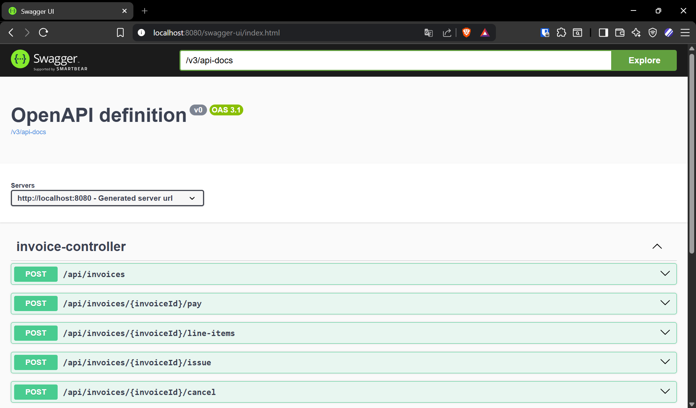

---

## Paso 0 — Sembrar un cliente y una regla de IVA regional

La API no expone un endpoint para crear `customers` (ver README) — se insertan directo en la base. Aprovechamos este paso para sembrar también una `TaxRule` regional distinta al 21% por defecto, así el Paso 2 puede mostrar esa capacidad.

Conectate a la base:

```bash
docker exec -it invoice-generator-db psql -U invoice -d invoice_generator
```

Y ejecutá:

```sql
-- Regla de IVA para la región UY (22%, distinta del 21% por defecto)
INSERT INTO tax_rules (id, region_code, rate, description)
VALUES (gen_random_uuid(), 'UY', 0.2200, 'IVA Uruguay')
RETURNING id;

-- Cliente en esa región
INSERT INTO customers (id, name, tax_id, email, region_code, street, city, postal_code, country)
VALUES (gen_random_uuid(), 'Acme Software S.A.', '21-12345678-9', 'facturacion@acme.com',
        'UY', 'Av. 18 de Julio 1234', 'Montevideo', '11200', 'Uruguay')
RETURNING id;
```

**Copiá el `id` que devuelve el segundo `INSERT`** (el del customer) — lo vas a necesitar como `{customerId}` en el Paso 1.

📸 **Captura 0 — Seed de datos (opcional, da contexto)**
Captura de la terminal `psql` mostrando ambos `INSERT ... RETURNING` con sus ids.
Guardar como: `docs/images/caso-de-uso/00b-seed-datos.png`

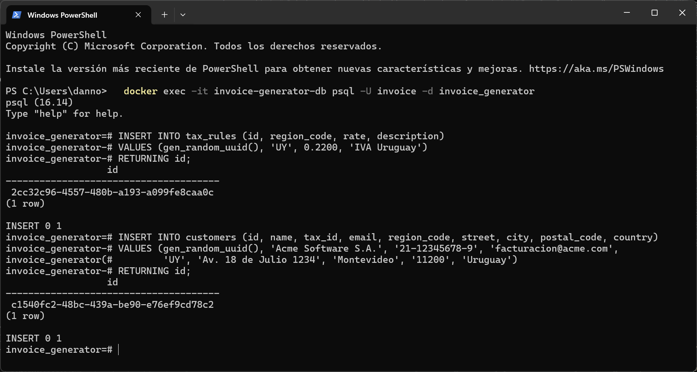

---

## Paso 1 — Crear la factura (estado `DRAFT`)

**Petición:** `POST /api/invoices`

```bash
curl -X POST http://localhost:8080/api/invoices \
  -H "Content-Type: application/json" \
  -d '{
        "customerId": "{customerId}",
        "dueDate": "2026-08-05"
      }'
```

> En Swagger UI: expandí `POST /api/invoices` → **Try it out** → pegá el body de arriba (reemplazando `{customerId}`) → **Execute**.

**Respuesta esperada** (`201 Created`): `status: "DRAFT"`, `number: null` (todavía no se emitió), `lineItems: []`, totales en `0`.

**Guardá el `id` de la respuesta** — es el `{invoiceId}` que se usa en todos los pasos siguientes.

📸 **Captura 01 — Factura creada en DRAFT**
Captura del panel de respuesta (Swagger UI: sección "Response body" tras Execute, o la terminal si usás curl) mostrando el JSON completo con `status: "DRAFT"` y `number: null`.
Guardar como: `docs/images/caso-de-uso/01-crear-factura-draft.png`

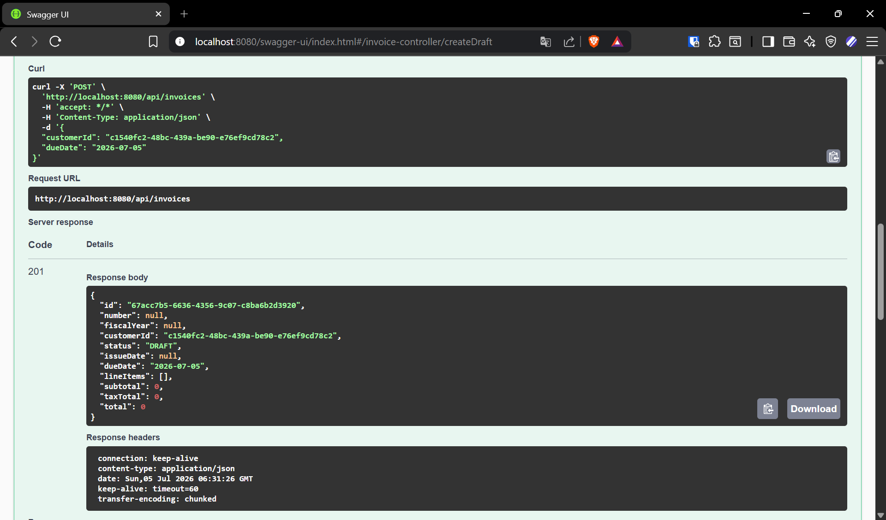

---

## Paso 2 — Agregar el primer ítem

**Petición:** `POST /api/invoices/{invoiceId}/line-items`

```bash
curl -X POST http://localhost:8080/api/invoices/{invoiceId}/line-items \
  -H "Content-Type: application/json" \
  -d '{
        "description": "Consultoría de desarrollo - Sprint 1",
        "quantity": 40,
        "unitPrice": 50.00
      }'
```

**Respuesta esperada** (`201 Created`): el `LineItemResponse` con `taxRate: 0.2200` (la regla regional `UY` sembrada en el Paso 0, no el 21% por defecto), `subtotal: 2000.00`, `taxAmount: 440.00`, `total: 2440.00`.

Este paso demuestra la regla de negocio "IVA configurable por región del cliente" (`TaxRule` en vez del `DEFAULT_RATE`).

📸 **Captura 02 — Primer ítem agregado**
Captura de la respuesta mostrando el ítem con su `taxRate` regional aplicado.
Guardar como: `docs/images/caso-de-uso/02-agregar-item-1.png`

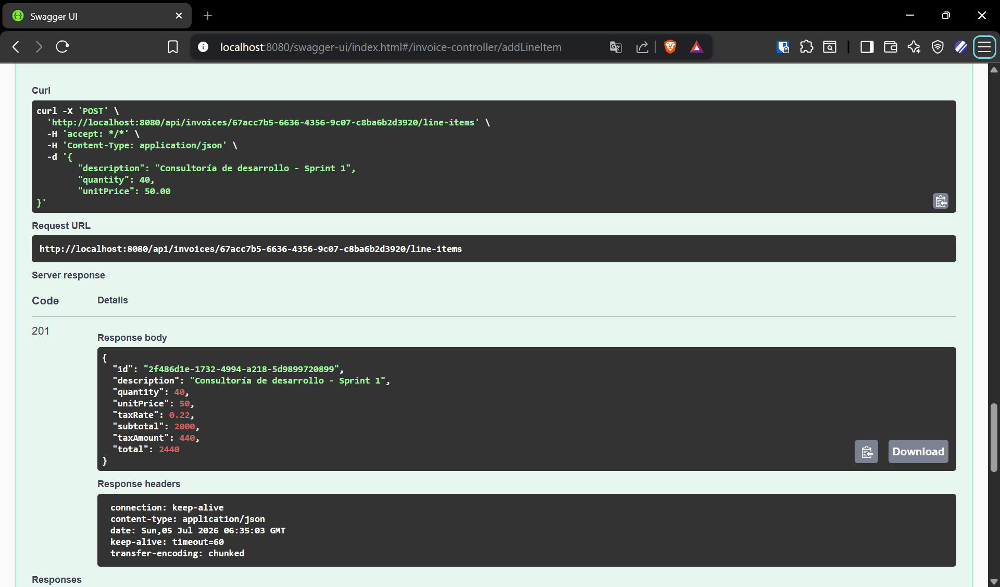

---

## Paso 3 — Agregar un segundo ítem

**Petición:** `POST /api/invoices/{invoiceId}/line-items`

```bash
curl -X POST http://localhost:8080/api/invoices/{invoiceId}/line-items \
  -H "Content-Type: application/json" \
  -d '{
        "description": "Licencia de software - anual",
        "quantity": 1,
        "unitPrice": 1200.00
      }'
```

Después, hacé un `GET /api/invoices/{invoiceId}` para ver la factura completa con ambos ítems y los totales acumulados.

```bash
curl http://localhost:8080/api/invoices/{invoiceId}
```

📸 **Captura 03 — Factura con dos ítems y totales acumulados**
Captura de la respuesta del `GET`, mostrando el array `lineItems` con los dos ítems y los campos `subtotal`, `taxTotal`, `total` ya sumados.
Guardar como: `docs/images/caso-de-uso/03-dos-items-totales.png`

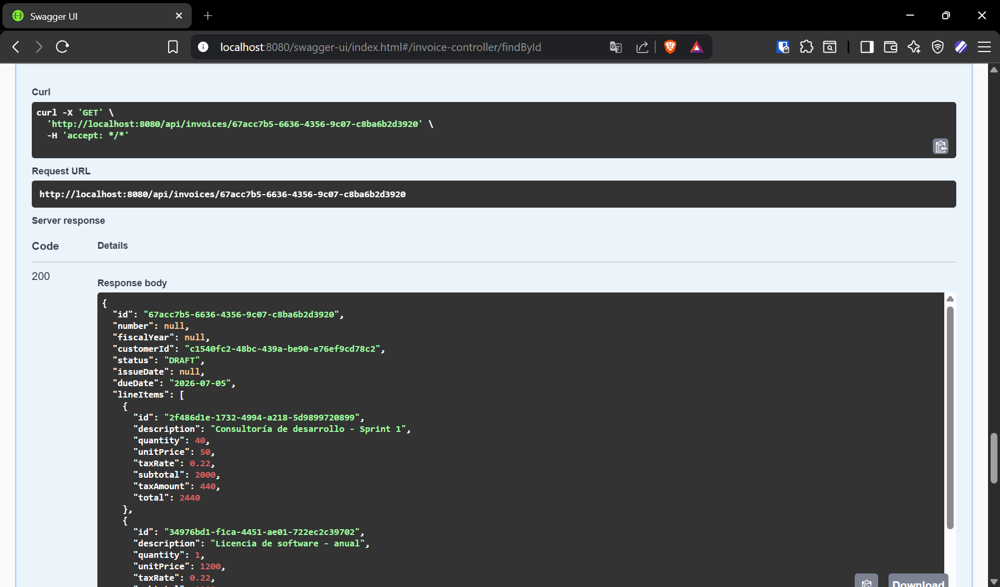

---

## Paso 4 — Emitir la factura

**Petición:** `POST /api/invoices/{invoiceId}/issue`

```bash
curl -X POST http://localhost:8080/api/invoices/{invoiceId}/issue
```

**Respuesta esperada** (`200 OK`): `status: "ISSUED"`, `number` ahora tiene un valor con formato `INV-2026-{secuencial}`, `issueDate` seteado.

Este paso demuestra la numeración fiscal (`InvoiceNumberGenerator`, única por año fiscal).

📸 **Captura 04 — Factura emitida con número asignado**
Captura de la respuesta mostrando `status: "ISSUED"` y el campo `number` con el formato `INV-2026-XXXX`.
Guardar como: `docs/images/caso-de-uso/04-emitir-factura.png`

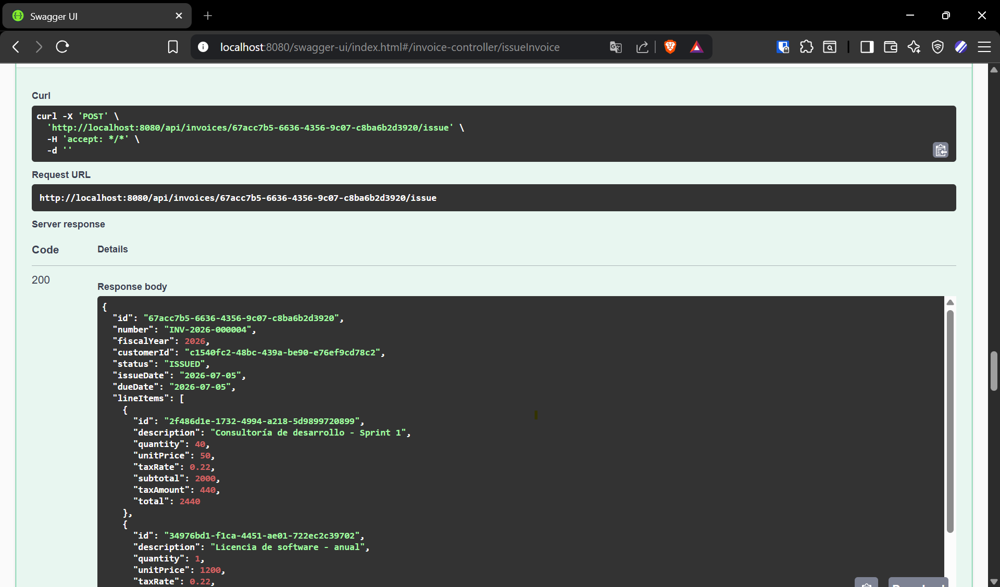

---

## Paso 5 — Descargar el PDF generado con JasperReports

**Petición:** `GET /api/invoices/{invoiceId}/pdf`

```bash
curl http://localhost:8080/api/invoices/{invoiceId}/pdf --output factura.pdf
```

> En Swagger UI: `GET /{invoiceId}/pdf` → Try it out → Execute → botón **Download file** en la respuesta.

Abrí el PDF descargado con cualquier visor.

📸 **Captura 05a — Response de Swagger UI ofreciendo la descarga**
Captura del panel de respuesta con el botón de descarga y el `Content-Type: application/pdf` visible en los headers.
Guardar como: `docs/images/caso-de-uso/05a-descarga-pdf.png`

📸 **Captura 05b — PDF renderizado (la más importante de toda la guía)**
Abrí `factura.pdf` y capturá el documento completo: encabezado con datos del cliente, tabla de ítems (subreport `sub_line_items.jrxml`), y totales.
Guardar como: `docs/images/caso-de-uso/05b-pdf-renderizado.png`

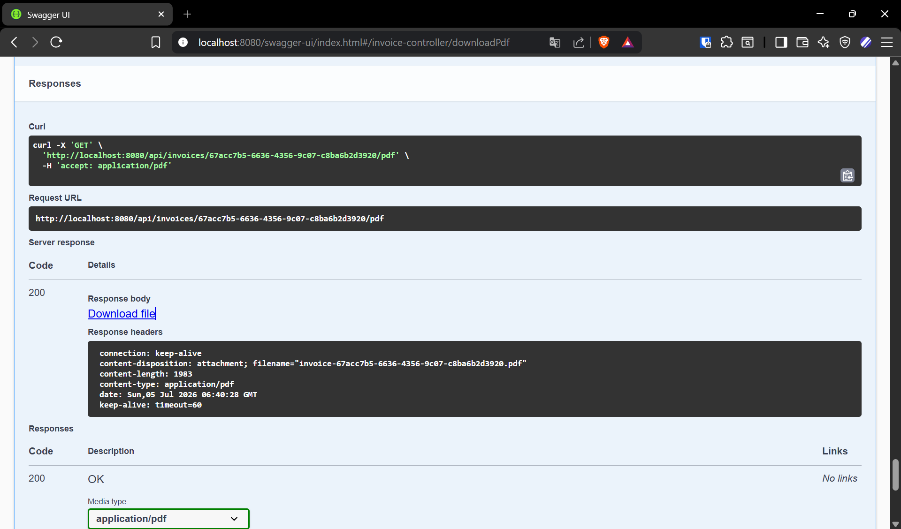

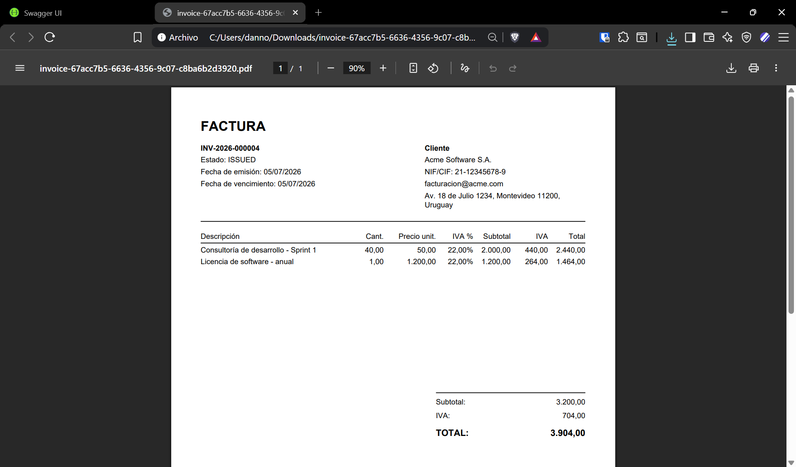

---

## Paso 6 — Marcar la factura como pagada

**Petición:** `POST /api/invoices/{invoiceId}/pay`

```bash
curl -X POST http://localhost:8080/api/invoices/{invoiceId}/pay
```

**Respuesta esperada** (`200 OK`): `status: "PAID"`.

📸 **Captura 06 — Factura marcada como PAID**
Captura de la respuesta mostrando `status: "PAID"`.
Guardar como: `docs/images/caso-de-uso/06-marcar-pagada.png`

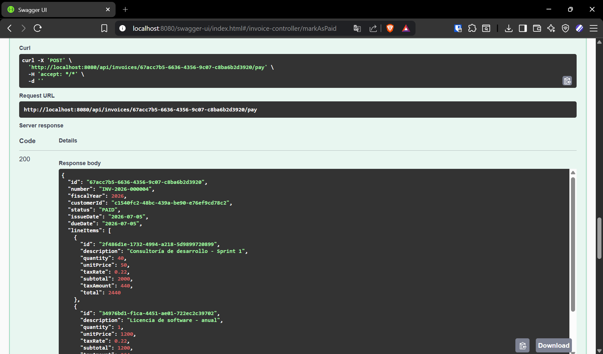

---

## Paso 7 — Regla de inmutabilidad: intentar modificar una factura pagada

**Petición:** `POST /api/invoices/{invoiceId}/line-items` (sobre la misma factura ya `PAID`)

```bash
curl -i -X POST http://localhost:8080/api/invoices/{invoiceId}/line-items \
  -H "Content-Type: application/json" \
  -d '{
        "description": "Este ítem no debería poder agregarse",
        "quantity": 1,
        "unitPrice": 10.00
      }'
```

**Respuesta esperada:** `409 Conflict`, cuerpo `ProblemDetail` (RFC 7807) con el mensaje de `InvoiceNotModifiableException`.

Este paso demuestra que la app no solo tiene un "happy path": las reglas de dominio (factura `PAID` no modificable) se traducen en errores HTTP bien formados, no en excepciones genéricas.

📸 **Captura 07 — Error 409 al modificar una factura pagada**
Captura de la respuesta completa: código de estado `409` y el cuerpo JSON `ProblemDetail` con el `detail` del error.
Guardar como: `docs/images/caso-de-uso/07-error-factura-pagada.png`

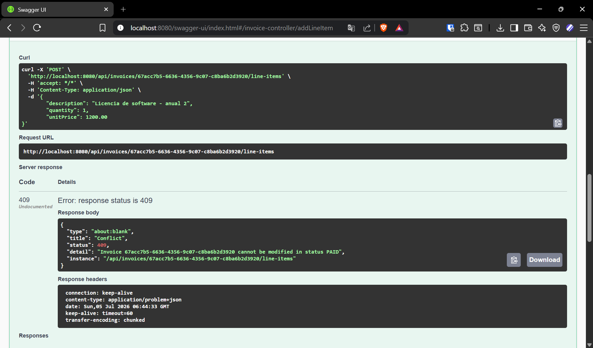

---

## Paso 8 (opcional) — Camino alternativo: cancelar una factura en DRAFT

Para mostrar la otra rama del ciclo de vida, repetí el Paso 1 para crear una **segunda** factura (mismo `customerId`) y, sin emitirla, cancelala directamente:

```bash
curl -X POST http://localhost:8080/api/invoices/{otroInvoiceId}/cancel
```

**Respuesta esperada** (`200 OK`): `status: "CANCELLED"`.

📸 **Captura 08 — Factura cancelada desde DRAFT**
Captura de la respuesta mostrando `status: "CANCELLED"`.
Guardar como: `docs/images/caso-de-uso/08-cancelar-factura.png`

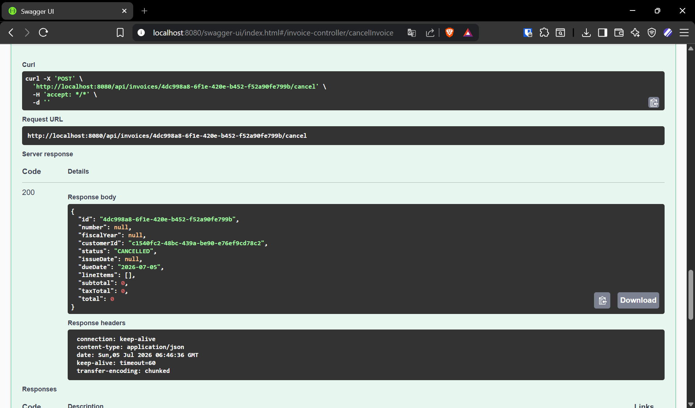

---

## Resumen del recorrido

| Paso | Endpoint | Estado resultante | Regla de negocio demostrada |
|---|---|---|---|
| 1 | `POST /api/invoices` | `DRAFT` | Creación básica |
| 2-3 | `POST /{id}/line-items` | `DRAFT` | IVA por región (`TaxRule`) |
| 4 | `POST /{id}/issue` | `ISSUED` | Numeración fiscal única por año |
| 5 | `GET /{id}/pdf` | `ISSUED` | Generación de PDF con JasperReports |
| 6 | `POST /{id}/pay` | `PAID` | Transición de estado |
| 7 | `POST /{id}/line-items` (falla) | `PAID` | Inmutabilidad de facturas pagadas |
| 8 | `POST /{id}/cancel` | `CANCELLED` | Camino alternativo del ciclo de vida |
